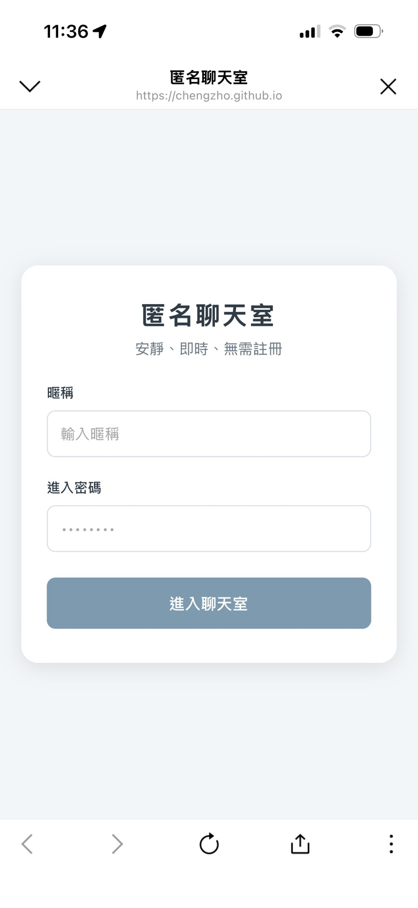
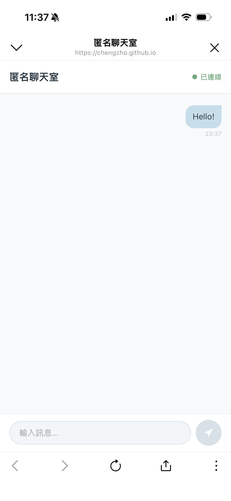
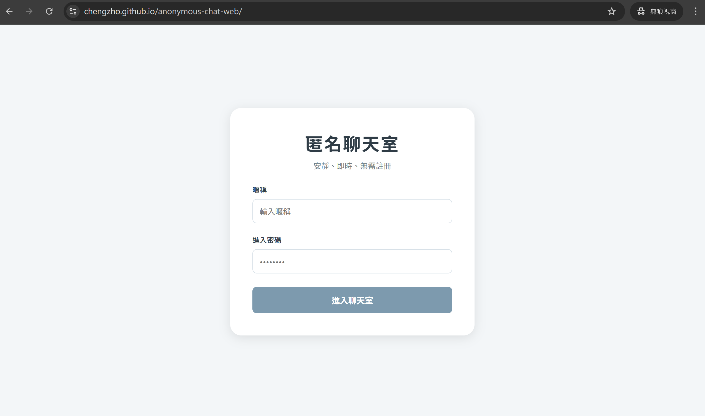
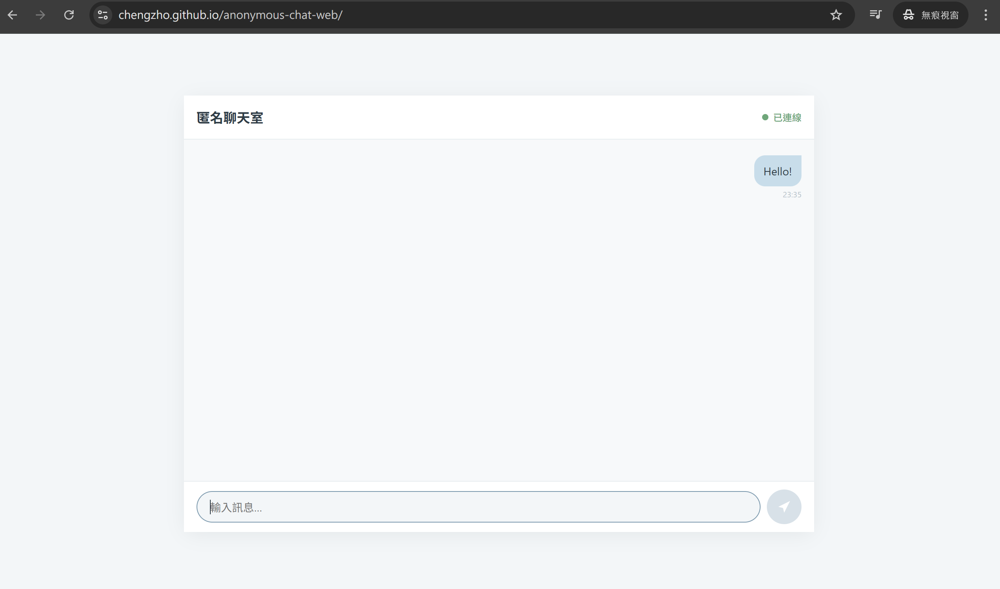

# Anonymous Chatting Web — 匿名聊天室

一個安靜、輕量、快速進入的匿名聊天室。  
使用者不需要註冊帳號，只要輸入暱稱與進入密碼，就能加入同一個聊天室進行即時對話。

> 本網站以真實場景使用為目標，介面採用冷淡、柔和的霧藍灰色調，減少視覺干擾，讓使用者能自然、輕鬆地進行多人聊天。

---

## Demo

GitHub Pages：https://chengzho.github.io/anonymous-chat-web/

---

## 專案特色

- 匿名聊天室，使用者不需要註冊帳號
- 使用 shared passcode 控制聊天室進入權限
- 前端不儲存正確密碼，密碼驗證由後端 `$connect` Lambda 處理
- 使用 WebSocket 建立即時多人聊天功能
- 訊息即時廣播給所有在線使用者
- DynamoDB 僅儲存目前有效連線，不儲存聊天紀錄
- 使用 GitHub Pages 部署前端
- 使用 AWS API Gateway WebSocket API、Lambda、DynamoDB 建立 serverless backend

---

## Tech Stack

| Layer | Technology |
|---|---|
| Frontend | React, Vite, TypeScript |
| Styling | CSS, Responsive Web Design |
| Hosting | GitHub Pages |
| Real-time API | AWS API Gateway WebSocket API |
| Backend | AWS Lambda, Python 3.12 |
| Database | DynamoDB |
| Infrastructure | AWS SAM, CloudFormation |
| Deployment | GitHub Actions, SAM CLI |
| AI-assisted Workflow | Pencil, Claude Code |

---

## 專案畫面

<p align="center">
  
  
</p>
<p align="center">
  
</p>
<p align="center">
  
</p>

---

## 本地開發

前端專案位於 `webui/`。

```bash
cd webui
npm install
npm run dev
```

若要在本機連接已部署的 AWS WebSocket backend，請在 `webui/` 下建立 `.env.local`：

```
VITE_WS_ENDPOINT=wss://your-api-id.execute-api.us-west-2.amazonaws.com/prod
```

接著重新啟動 Vite dev server：

```bash
npm run dev
```

請注意，`.env.local` 僅供本機開發使用，不應提交到 GitHub。

---

## Shared Passcode 設定

本專案使用 shared passcode 作為聊天室的進入限制。使用者在前端輸入的進入密碼會在 WebSocket `$connect` 階段傳送到後端，由 `connect` Lambda 進行驗證。

前端不會儲存或驗證正確密碼，也不會將正確密碼 hardcode 在程式碼中，部署後端前，需要先產生 passcode 的 SHA-256 hash。

產生的 64 字元 hash 會在 AWS SAM 部署時作為 `ChatAccessCodeHash` 參數傳入。明文 passcode 僅由專案管理者保存，並提供給允許進入聊天室的使用者。

---

## AWS Backend Deployment

後端使用 AWS SAM 部署，主要資源包含 API Gateway WebSocket API、三個 Lambda functions，以及 DynamoDB table。

部署前請確認 AWS CLI 與 SAM CLI 已設定完成：

```bash
aws --version
sam --version
aws sts get-caller-identity
```

建置並驗證 SAM template：

```bash
sam validate --template template.yaml
sam build
```

第一次部署：

```bash
sam deploy --guided
```

部署時需要設定：

```
Stack Name: anonymous-chat-web
AWS Region: us-west-2
ChatAccessCodeHash: <SHA-256 hash of shared passcode>
MaxConnections: 10
```

---

## Frontend Deployment

前端透過 GitHub Actions 部署到 GitHub Pages。

GitHub repository 需要設定一個 Actions secret：

```
VITE_WS_ENDPOINT=wss://your-api-id.execute-api.us-west-2.amazonaws.com/prod
```

當程式 push 到 `main` branch 後，GitHub Actions 會自動進入 `webui/`，安裝 dependencies，執行 build，並將 `webui/dist` 部署到 GitHub Pages。

---

## 系統架構

```
Browser
  │
  ▼
GitHub Pages
(React + Vite + TypeScript Frontend)
  │
  │ WebSocket
  ▼
AWS API Gateway WebSocket API
  ├── $connect     → connect Lambda ───────┐
  ├── $disconnect  → disconnect Lambda ────┼──→ DynamoDB ChatConnections
  └── sendMessage  → send_message Lambda ──┘
```

系統使用 API Gateway WebSocket API 負責連線管理，Lambda 負責處理連線、斷線與訊息廣播，DynamoDB 則用來記錄目前在線的 WebSocket connection。

聊天訊息不會被儲存，DynamoDB 只保存目前在線使用者的 `connectionId`、`callsign` 與 `connectedAt`。

---

## 專案結構

```
anonymous-chat-web/
├── documents/
├── webui/
├── lambda/
│   ├── connect/
│   ├── disconnect/
│   └── send_message/
├── events/
├── .github/
│   └── workflows/
├── template.yaml
├── README.md
└── .gitignore
```

---

## 設計與開發流程

1. 撰寫系統架構與 API 規格文件
2. 使用 Pencil 根據需求與前端設計文件產生 UI 設計稿（`.pen`）
3. 使用 Claude Code 根據文件與設計稿協作 React 前端
4. 使用 Claude Code 根據 Lambda 規格與 AWS 設定文件協作後端
5. 使用 AWS SAM 部署 serverless backend
6. 使用 GitHub Actions 部署 GitHub Pages frontend
7. 進行 WebSocket 測試

---

## 後續延伸方向

- 加入使用者加入 / 離開聊天室的 system message 廣播
- 增加聊天室人數顯示
- 增加訊息送出失敗提示與重試機制
- 加入深色模式
- 加入多聊天室或 room code 設計
- 使用更完整的 rate limiting 或 WebSocket connection control
- 建立更嚴格的 IAM least-privilege deployment policy